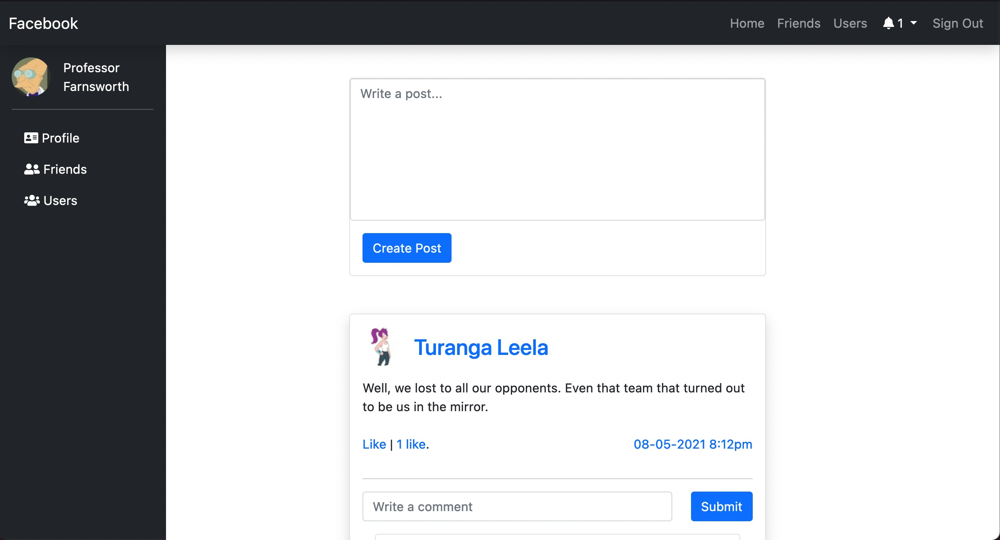
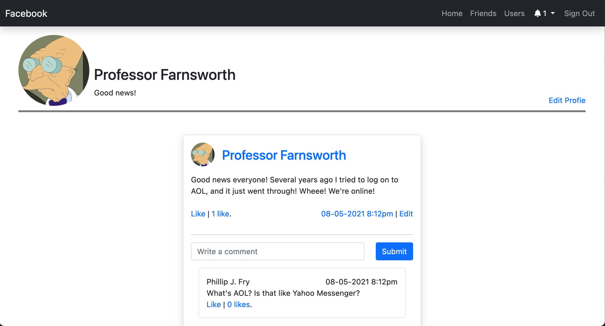
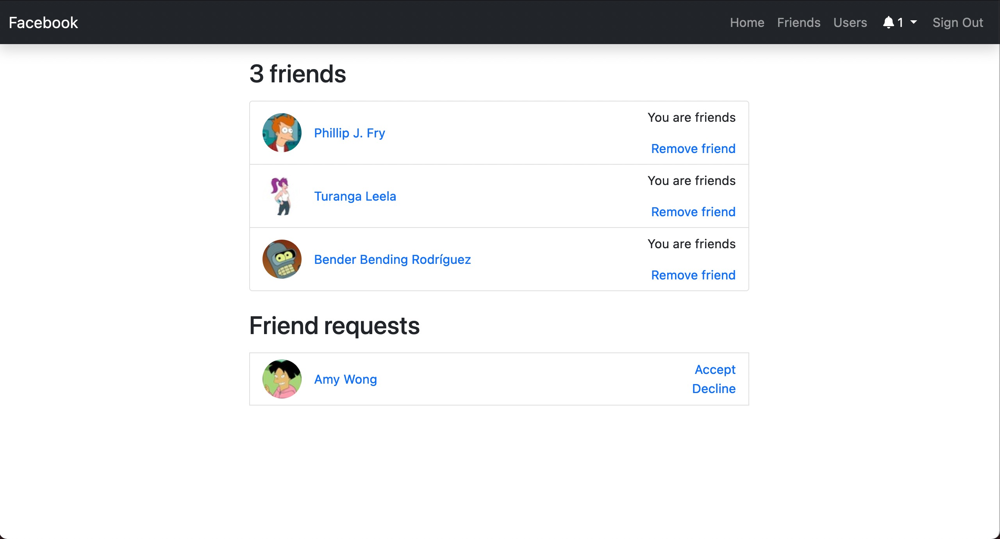

# Facebook - Rails Final Project

This project aims to mimic the main features of a social media web app like facebook. Users have their own profile where they can customize their own biography as well as profile image. Users can create posts, comment on posts and like posts or comments. Users can become friends (as well as unfriend) and can only see posts of others that they are friends with.

Project idea from [the Odin Project](https://www.theodinproject.com/paths/full-stack-ruby-on-rails/courses/ruby-on-rails/lessons/final-project)

## Screenshots

### Main page

### Users page

### Friends page

## Data Model
### Relationship
The relationship model keeps track of relationships (i.e. friendships) between users. Status denotes what kind of relationship users may have.

#### Status codes
|Code | Description
--- | --- |
|0|pending friend request|
|1|declined friend request|
|2|users are friends|
|3|users are blocked from being friends|

### Notification
The notification model keeps track of every users set of notifications. The type column denotes whether the notification is for a friend request, liked post or liked comment.

|Type code | Description
--- | --- |
|0|User sent friend request|
|1|User accepted friend request|
